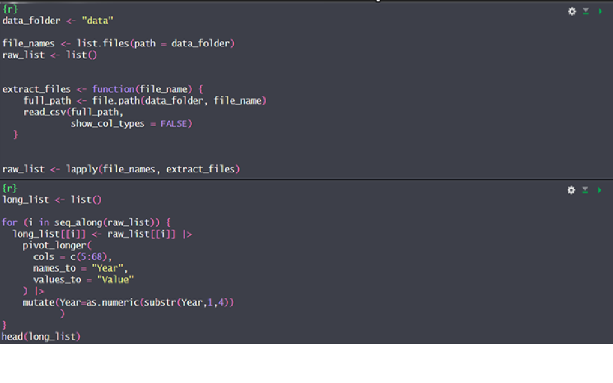
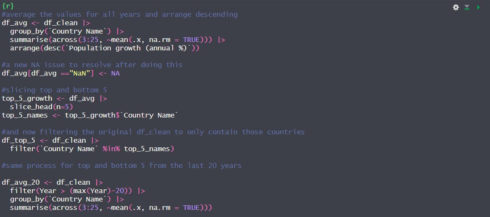
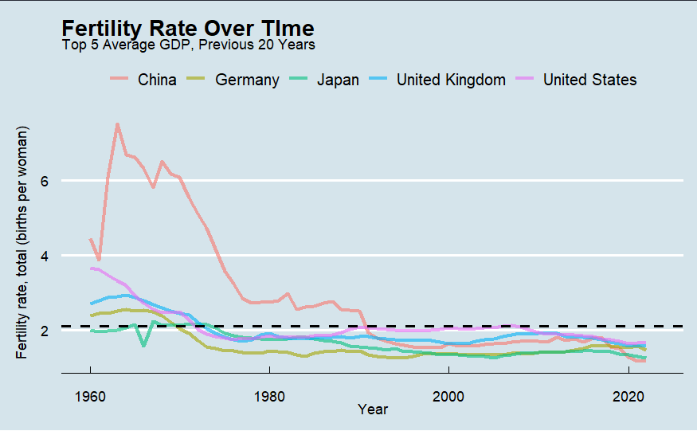

# Data Wrangling
This course covered methods for manipulating, cleaning, and plotting data using R and associated packages. For my final project I chose to look at data from the World Bank focusing on demographics and some various associated measurements. I obtained all data from the World Bank Databank, focusing on:
* Health Nutrition and Population Statistics
* Development Indicators

### Tools and Dependencies
**Language:** R
**Libraries:** dplyr, tidyr, tidyverse, ggplot2, plotly, patchwork, ggthemes, scales
**Tools:** Rstudio  
Note: In order to run code as is, structure folder similarly to the repository.

### Key Objectives and Results
I was able to use R to read in many different csv's and create a dataframe to conduct my exploration. I created a good number of different average slices to see interesting portions of the data. Finally I generated plots that I found interesting to report on.

### Repository Contents
├── data/  
├── snips/  
├── Country List.csv  
├── project_final.qmd    
└── README.md

### Greatest hits of Data Wrangling

##### File read in using a list

##### Slicing for plots

###### Plot examples

